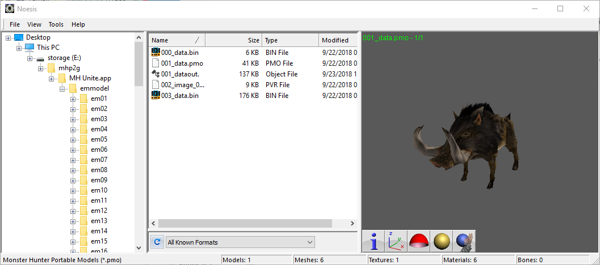
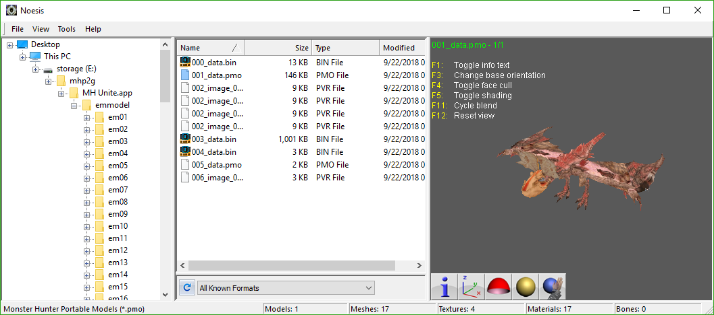

# MHFU iOS Plugin for Noesis (Alpha)
A plugin to display Monster Hunter Freedom United iOS(モンスターハンターP２G iOS) pmo models in [Noesis](https://richwhitehouse.com/index.php?content=inc_projects.php). Not compatible with the PSP version.

## Instruction

First, [mhtools](https://github.com/codestation/mhtools) should be used to extract `.pac` file in `emmodel` folder in the ipa package of MHFU/MHP2G.

Usally, a `.pac` file is consist of a binary section (the skeleton), a `.pmo` file (the model), a `.tmh` file (textures), and another binary section (the animation). The `.tmh` file can be further extracted to get one or more `.pvr` texture files, which is a format already supported by Noesis. The format of `.tmh` file is fairly easy so you should try to extract it by yourself. Name the extrected `.pvr` files the same as the `.tmh` file but followed by numbers.

Put `fmt_mhskeleton_bin.py` and `fmt_mnstrhntr_pmo.py` in the `plugin/python` folder in Noesis. Done.

__The wireframe mode need to be enabled to view the skeleton.__

The rules of texture mapping is still unclear, so wrong texture mapping is sometimes expected.

Notice that the texture for the wings of Yian Kut-Ku is wrong.

